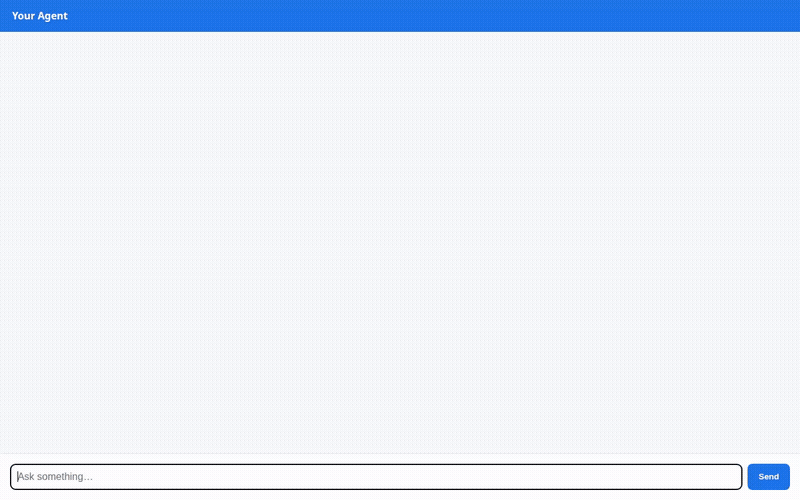

# Quantitative Swing Trading Agent

An autonomous swing trading intelligence agent built with the **Google Agent Development Kit (ADK)** and `agents-cli`. The agent automates technical moving average crossover strategies, fetches real-time market sentiment catalysts, manages persistent watchlists in **Google Cloud Firestore**, generates dynamic 3D financial market visualizations using Google's Omni model (**`gemini-omni-flash-preview`**), and emits structured **A2UI** interactive display cards.



---

## What the Agent Does

The agent evaluates swing trade setups using disciplined technical and fundamental data without paid API keys, persists trade ideas across conversations, and generates visual video briefs:

1. **Company & Ticker Resolution (`search_ticker`)**:
   - Maps everyday company names (e.g., "Apple", "NVIDIA", "Microsoft") to official stock tickers and primary exchange identifiers.

2. **1-Year Crossover & Momentum Engine (`get_crossover_signals`)**:
   - Retrieves 1-year daily OHLCV candlestick data.
   - Computes **20-day**, **50-day**, and **200-day Simple Moving Averages (SMA)**.
   - Calculates **14-day Relative Strength Index (RSI)** for momentum confirmation.
   - Scans for recent **Golden Cross** (bullish) and **Death Cross** (bearish) signals.
   - Derives risk-managed swing trade parameters: Entry Price, 20-day Support, Resistance, Suggested Stop-Loss, and Take-Profit Targets with conviction scores.

3. **News Sentiment & Catalyst Risk Analysis (`get_company_news_sentiment`)**:
   - Parses real-time financial headlines directly from RSS feeds.
   - Identifies high-impact market catalysts (earnings surprises, regulatory updates, M&A activity) before entering positions.

4. **Persistent Portfolio Watchlist (`add_to_watchlist`, `get_watchlist`, `remove_from_watchlist`)**:
   - Fully backed by **Google Cloud Firestore** in Native mode.
   - Maintains a structured `watchlist` collection persisting user target prices, entry levels, and stop losses across sessions.

5. **Omni 3D Financial Video Generation (`generate_stock_video`)**:
   - Generates motion graphics and dynamic 3D candlestick chart videos using Google's Omni model **`gemini-omni-flash-preview`** in the `global` region.
   - Saves generated video bytes as an ADK session artifact (`tool_context.save_artifact`) for the development playground.
   - Streams video bytes directly to a public **Google Cloud Storage** bucket, returning a public HTTPS URL without writing temporary files to local disk.

6. **A2UI Rich Card Display**:
   - Uses `A2uiSchemaManager` (version 0.8) and `BasicCatalog` to emit structured UI components (`Card`, `Column`, `Row`, `Text`, `Image`).
   - Wired via an ADK `after_model_callback` (`app/a2ui_utils.py`) to render visual cards natively in supported chat interfaces.

---

## Google Cloud Services Used

- **Vertex AI Agent Platform / Agent Runtime**: Deploys and hosts the agent runtime engine with A2A protocol support.
- **Gemini Models via Vertex AI**:
  - `gemini-2.5-flash`: Reasoning model driving trade planning, tool invocation, and A2UI card generation.
  - `gemini-omni-flash-preview` (`global` region): Generates high-definition motion videos and financial charts.
- **Google Cloud Firestore (Native Mode)**: Persists watchlist items and trade plans.
- **Google Cloud Storage (GCS)**: Hosts public MP4 video assets generated by the Omni model.
- **Vertex AI Memory Bank**: Managed long-term cross-session memory (`agentengine://6044338674303238144`) powered by `PreloadMemoryTool` and `add_events_to_memory`, allowing the agent to remember user names, risk tolerance, and trading constraints across completely independent conversation sessions.

*(Note: Custom Vertex RAG Engine corpora were evaluated during architecture planning but are not implemented in the current codebase).*

---

## Project Structure

```
simple-agent/
├── app/
│   ├── agent.py               # Root ADK agent configuration & tool definitions
│   ├── a2ui_prompt.py         # Pre-generated A2UI v0.8 schema system prompt
│   ├── trading_tools.py       # Technical indicator engine & live RSS news sentiment
│   ├── firestore_backend.py   # Firestore watchlist CRUD tools
│   ├── video_tool.py          # Omni video generator & GCS bucket uploader
│   ├── a2ui_utils.py          # A2UI callback transformer for rich cards
│   └── fast_api_app.py        # FastAPI A2A backend runner
├── frontend/                  # Standalone FastAPI proxy and chat UI
│   ├── main.py                # A2A proxy server
│   ├── Dockerfile             # Container configuration for Cloud Run
│   └── static/                # Vanilla HTML/JS chat frontend with A2UI card renderer
├── watchlist_notifier.py      # Automated periodic watchlist scanner & alert script
├── agents-cli-manifest.yaml   # Agent platform deployment metadata
├── pyproject.toml             # Python dependencies (uv)
└── demo.gif                   # Recorded demonstration of the agent in action
```

---

## Local Setup & Run Instructions

### Prerequisites
- Python 3.11+
- [uv](https://docs.astral.sh/uv/getting-started/installation/) package manager
- [Google Cloud SDK (gcloud)](https://cloud.google.com/sdk/docs/install) authenticated with Application Default Credentials (`gcloud auth application-default login`)

### 1. Install Dependencies
```bash
uv sync
```

### 2. Set Up Environment Variables
Ensure your Google Cloud project is configured:
```bash
export GOOGLE_CLOUD_PROJECT="<YOUR_PROJECT_ID>"
export GOOGLE_GENAI_USE_ENTERPRISE="true"
```

### 3. Run the Agent Locally (ADK Web Dev UI)
Launch the local agent playground:
```bash
uv run adk web --port 8080 --allow_origins "*" --reload_agents
```
Open a browser and navigate to the local development UI at port 8080 (`/dev-ui/?app=app`).

### 4. Run the Standalone Chat Frontend (Optional)
To run the included proxy frontend:
```bash
cd frontend
pip install -r requirements.txt
export AGENT_ENGINE_RESOURCE_NAME="<YOUR_DEPLOYED_AGENT_RESOURCE_NAME>"
export AGENT_DIRECTORY="app"
uvicorn main:app --host 0.0.0.0 --port 8080
```
